[README.md](https://github.com/user-attachments/files/29947337/README.md)

  

 

## Currently

Leading BI and analytics for a 15-entity ERP/PLM transformation at Atlas Copco — building the reporting layer that turns ENOVIA and 3DEXPERIENCE data into decisions leadership can act on the same day. Alongside that, I run **Bivonix**, an independent studio where I build BI systems, AI applications, and web products for people who need more than a dashboard.

Most recently: **Portfolio Builder**, an AI app that reads a résumé through the Claude API and generates a portfolio site with a genuinely unique design system every time — not a template picker.

## What I actually do

I don't just "know Power BI." I build decision engines — systems that take fragmented, noisy operational data from manufacturing floors, aerospace programmes, and pharma trials, and turn it into something an executive can read in the time it takes to open a laptop.

I don't just "know Python." I build what sits underneath the dashboards — the pipelines, the scheduled jobs, the agents nobody sees — so the number on screen is already trustworthy by the time someone looks at it.

I don't just "use AI tools." I build with them. The Claude API, MCP servers, and agentic workflows are part of how I ship now, not a novelty bolted on after the fact.

## Focus Areas

<b>Data Engineering & BI</b> — click to expand

 

Power BI, Databricks, SQL Server, Oracle, Python — the layer that turns raw operational data into something leadership trusts.

- Atlas Copco ERP/PLM transformation — reporting layer across 15+ European entities
- Portfolio Builder — Supabase/Postgres as the data layer underneath the app

<b>AI & Automation</b> — click to expand

 

Claude API, MCP servers, agentic workflows — building with AI rather than just prompting it.

- Portfolio Builder — real Claude API tool-use extraction from a résumé, not regex over a free-form completion
- A custom Claude Desktop MCP stack for research, design, and outreach automation

<b>PLM</b> — click to expand

 

ENOVIA, 3DEXPERIENCE — the system of record for product data at enterprise scale.

- Atlas Copco — 15+ entity ERP/PLM transformation, ENOVIA/3DEXPERIENCE reporting
- 3-year goal: recognized PLM + data transformation specialist, deepening ENOVIA/3DEXPERIENCE expertise alongside AI agent capability

<b>Freelance / Bivonix</b> — click to expand

 

Independent BI + AI consulting studio, run alongside the day job.

- Portfolio Builder, Paris Breeze, and client BI work

## Roadmap

**Shipped**
Nine years of enterprise BI across aerospace, luxury, insurance, and pharma — Liebherr, Dior, AXA, Sanofi, Air France. Turning operational noise into board-level clarity, repeatedly, across industries that don't tolerate a wrong number.

**In Progress**
Atlas Copco's 15-entity PLM transformation. The Databricks Certified Data Engineer Associate cert. Bivonix, taking shape as a real second track rather than a side project.

**Next**
Becoming a recognized PLM + data transformation specialist — deepening ENOVIA/3DEXPERIENCE expertise alongside AI agent capability.

## Featured Work

**Portfolio Builder** — *AI personal-branding platform*
Most "AI portfolio generators" pick from a handful of templates. This one runs a seeded design-uniqueness engine across palette, typography, layout, and motion, with real Claude API tool-use extraction from a résumé — not regex parsing a free-form completion.
`Next.js 16` `Claude API` `Supabase` `Stripe` `GSAP` `Three.js`
[Live](https://portfolio-builder-one-alpha.vercel.app) · [Source](https://github.com/suhank007/portfolio-builder)

**Bivonix** — *BI + AI consulting studio*
Independent practice covering enterprise BI, PLM data transformation, and AI-powered web products.
[bivonix.com](https://bivonix.com)

**Paris Breeze** — *Cash-on-delivery storefront, built solo*
A same-day-delivery e-commerce site taken end to end — backend, checkout, order pipeline.
`Next.js` `Supabase` `Stripe`

> The two entries above are placeholders on purpose — I don't have real screenshots or verified numbers for them yet. Send me those (or for any other project) and I'll build the full case-study treatment instead.

## Stack

**Data & BI**  Power BI · Databricks · Dataiku · SQL Server · Oracle · Python · R
**PLM**  ENOVIA · 3DEXPERIENCE
**Web & AI**  Next.js · React · TypeScript · Tailwind · Supabase · Claude API · MCP · Framer Motion · Three.js · GSAP
**Automation**  n8n · Zapier · Apollo.io · Clay
**Creative**  Higgsfield · Descript · DaVinci Resolve · FFmpeg · ElevenLabs

## Base

Born in India, based in Paris. Open to remote and relocation depending on the work.

## Numbers

  
  

[LinkedIn](https://linkedin.com/in/futureishere) &nbsp;·&nbsp; [Bivonix](https://bivonix.com)

